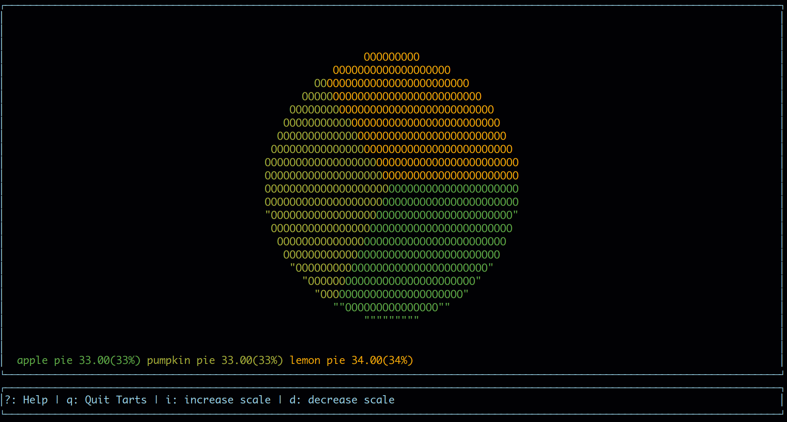
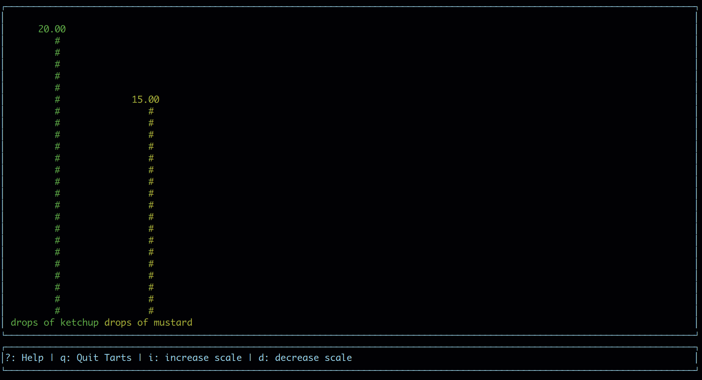
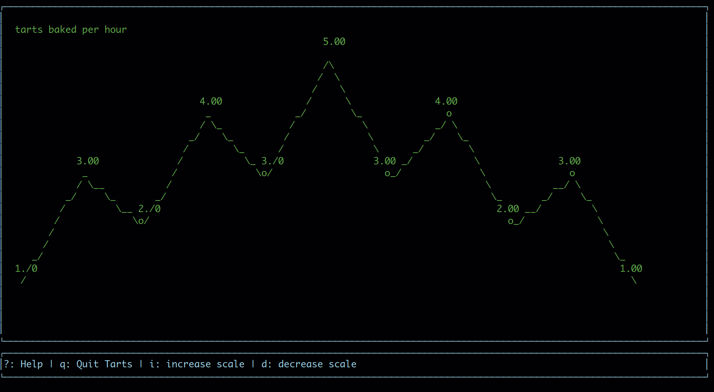

# T(ch)Arts


Plot charts on the terminal with ascii text.

## About:
This is a work in progress, the goal with this project is to have a program that can plot charts interactivelly, via the command line or reading a csv file.
This is not meant to be a super complete program, as ascii and terminals
have their limitations. The ideia is to have a fast and simple way to view
data on the terminal.

Bellow is a list of goals of this application.

## Goals:
+ [x] Be able to plot bar, line and pie charts
+ [x] Plot chart non interactivelly to the terminal and exit
+ [x] Be able to create charts with command line arguments
+ [ ] Be able to create new charts interactivelly
+ [ ] Create charts from CSV
+ [ ] Multiple panels to handle multiple chart views
+ [ ] Basic reports based on charts (total, average, minimum, maximum)

## Usage:
Tarts can be created via command line args.

For a complete list of arguments and their descriptions, run ```tart --help```.
The main arguments used are:
+ ```-t```(type), which specifies the type of the chart ```pie|line|bar```;
+ ```-v```(values), which is a comma spaced list of values for the charts, in case of bar charts only the first value is used;
+ and ```-l```(labels), which is a comma spaced list of labels for the values in the charts, in case of line and bar charts
only the first value is used.

### Examples:
create a pie chart with 3 portions: ```./tart -t pie -v "33,33,34" -l "apple pie,pumpkin pie,lemon pie"```


create two bar charts: ```./tart -t bar -v "20" -l "drops of ketchup" -t bar -v "15" -l "drops of mustard"```


create a long line chart: ```./tart -t line -v "1,3,2,4,3,6,3,4,2,3,1" -l "tarts baked per hour"```


## TODO:
This is a list of the features being developed currently.

+ Add command line color command
+ make create charts interactive command
+ use ISO escape sequences
